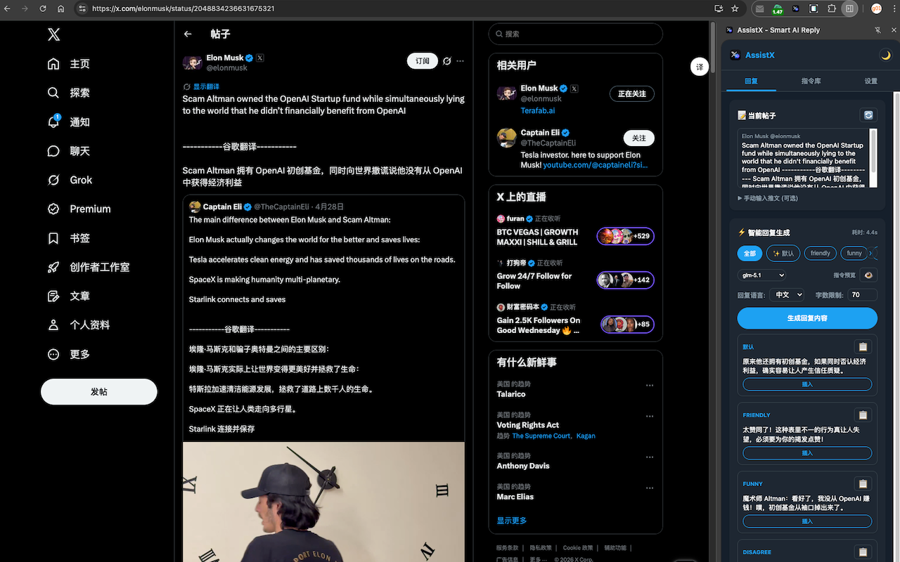
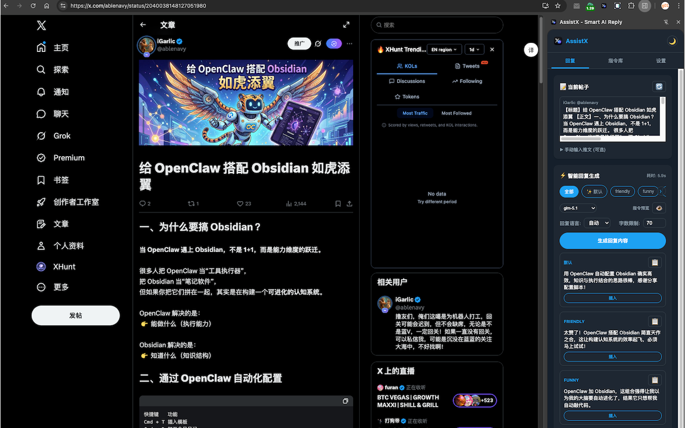
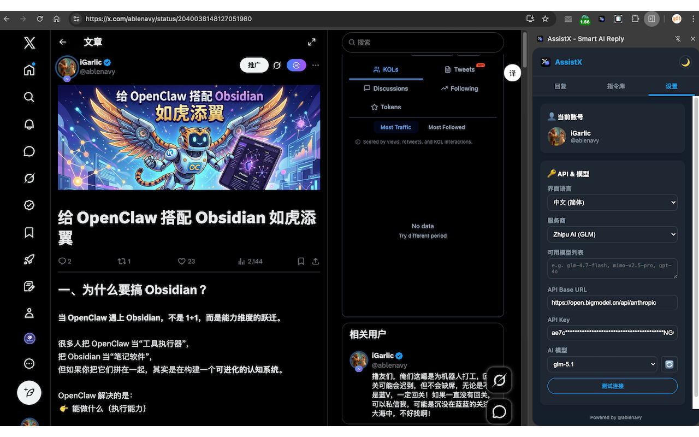
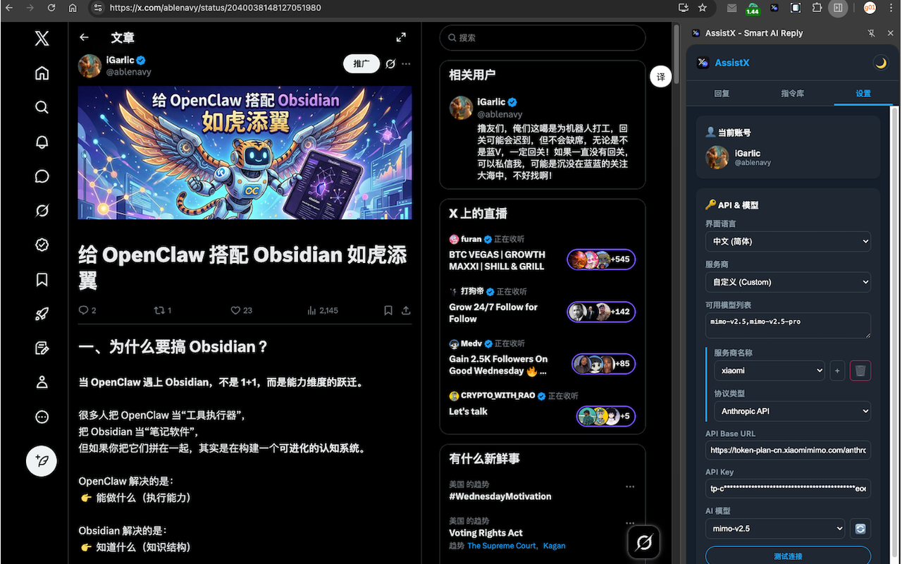
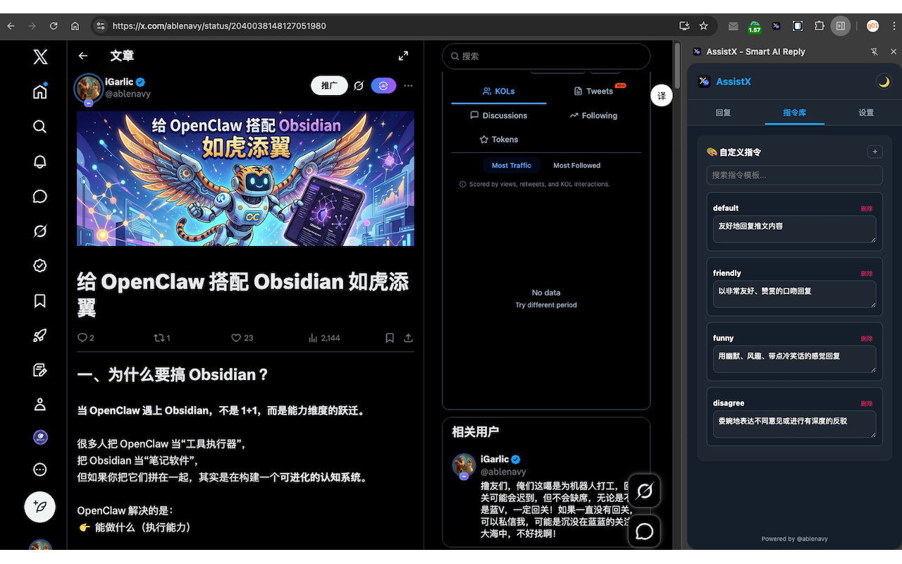

# AssistX - Smart AI Reply for Twitter/X

<p align="center">
  
  
</p>

<p align="center">
  <strong>AI-powered smart reply assistant for Twitter/X.</strong> Support GLM, GPT, Claude, DeepSeek & more.
</p>

<p align="center">
  <a href="https://chrome.google.com/webstore/detail/assistx"></a>
  <a href="./privacy.html"></a>
  
  
</p>

---

## Screenshots

| Smart Reply (Tweet) | Smart Reply (Article) |
|:---:|:---:|
|  |  |

| Multi-Provider Settings | Custom Provider Config | Prompt Library |
|:---:|:---:|:---:|
|  |  |  |

## Features

- **Smart Reply Generation** - Auto-extract tweet content, generate contextual AI replies with one click
- **Multi-Model Support** - GLM, GPT-4o, Claude, DeepSeek, and more
- **Dual Protocol** - Compatible with both OpenAI and Anthropic API formats
- **Multi-Provider** - Configure and switch between multiple AI providers seamlessly
- **Flexible UI** - Side Panel or Popup mode, your choice
- **Custom Prompts** - Save and manage your own prompt template library
- **Bilingual UI** - Full Chinese & English interface support
- **Direct Insert / Post** - Insert reply to compose box or publish instantly

## Installation

### From Chrome Web Store (Recommended)

> Coming soon — submit for review now.

### Developer Mode (Manual)

```bash
git clone https://github.com/hunterlarcuad/x-reply-assist.git
```

1. Open Chrome → `chrome://extensions/`
2. Enable **Developer mode** (top right toggle)
3. Click **Load unpacked** → select this folder
4. Click the extension icon → enter your API Key

## Quick Start

1. Navigate to any [tweet on X](https://x.com)
2. Click the AssistX icon to open the side panel
3. The extension auto-extracts the tweet content
4. Click **Generate Reply** — AI response appears in seconds
5. **Copy**, **Insert** into the compose box, or **Publish** directly

## Configuration

### API Key Setup

| Provider | Get Your Key |
|----------|-------------|
| **ZhipuAI (GLM)** | [open.bigmodel.cn/usercenter/apikeys](https://open.bigmodel.cn/usercenter/apikeys) |
| **OpenAI** | [platform.openai.com/api-keys](https://platform.openai.com/api-keys) |
| **Anthropic** | [console.anthropic.com/settings/keys](https://console.anthropic.com/settings/keys) |
| **Others** | Enter custom Base URL + API key in settings |

### Supported Models

| Provider | Models |
|----------|--------|
| GLM | `glm-4-plus`, `glm-4.5-air`, `glm-4.7`, `glm-4.7-flash`, `glm-5`, `glm-5-turbo`, `glm-5.1` |
| OpenAI | `gpt-4o`, `gpt-4o-mini`, `gpt-4-turbo`, `o1-preview`, `deepseek-chat`, `deepseek-coder` |
| Anthropic | `claude-3-5-sonnet-latest`, `claude-3-5-haiku-latest`, `claude-3-opus-latest` |

## Project Structure

```
├── manifest.json          # Manifest V3 config
├── background/            # Service worker
│   ├── api.js             # AI API integration (OpenAI + Anthropic)
│   └── index.js           # Message handling entry point
├── content/               # Content scripts (Twitter DOM)
│   ├── index.js           # Entry & message bridge
│   ├── loader.js          # Script injection
│   ├── sidebar.js         # Injected sidebar component
│   ├── twitter.js         # Twitter DOM handler
│   └── utils.js           # Prompt building utilities
├── libs/
│   └── storage.js         # Chrome storage wrapper
├── ui/
│   ├── popup.*            # Popup interface
│   └── sidepanel.*        # Side panel interface
└── assets/                # Icons (16/48/128/448px)
```

## Privacy

All data stays on your device:

- API keys stored locally via `chrome.storage.local`
- No accounts, no tracking, no analytics
- No data sent anywhere except your configured AI API endpoint
- Full privacy policy: [privacy.html](./privacy.html) | [Online](https://hunterlarcuad.github.io/x-reply-assist/privacy.html)

## Permissions Explained

| Permission | Purpose |
|------------|---------|
| `storage` | Securely save settings & API keys |
| `activeTab` | Access current tab to extract tweet content |
| `scripting` | Inject content scripts for Twitter/X interaction |
| `alarms` | Support scheduled tasks |
| `sidePanel` | Provide side panel UI |

## Tech Stack

- **Chrome Extension Manifest V3** with ES Modules
- **Zero dependencies** — pure vanilla JS, no frameworks
- **Service Worker** architecture (no background page)

## License

[MIT](LICENSE)
